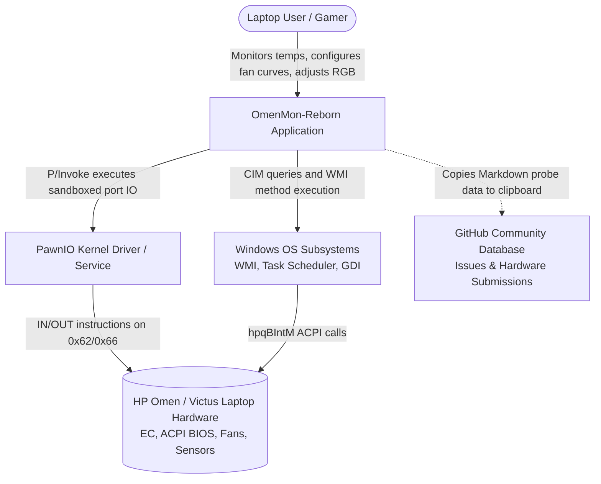
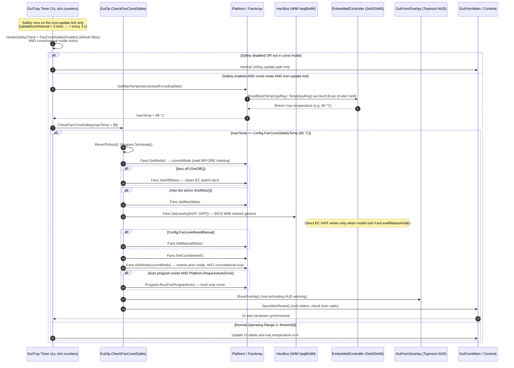

# Project Architecture Blueprint: OmenMon-Reborn

**Project:** OmenMon-Reborn (v1.4.0)  
**Document Version:** 1.0.0  
**Generated Date:** 2026-08-20  
**Status:** Approved & Definitive Reference  
**Technology Stack:** .NET Framework 4.8 / C# 11.0 / Windows Forms / PawnIO Kernel Sandbox / WMI (CIM)  
**Primary Pattern:** Multi-Tier Layered Hardware Abstraction Architecture with Event-Driven Thermal Control, Safe Heuristic Auto-Detection, and Dual-Mode CLI/GUI Presentation  

---

## Executive Summary

**OmenMon-Reborn** is a lightweight, open-source hardware monitoring, thermal management, keyboard lighting, and system configuration utility specifically engineered for HP Omen, Victus, and Pavilion gaming laptops. It serves as an ultra-low-overhead, zero-telemetry, offline-first alternative to heavy manufacturer software (such as the HP OMEN Gaming Hub) — the application itself performs no network I/O.

The architecture of OmenMon-Reborn is designed around strict principles of **hardware safety**, **HVCI (Memory Integrity) compliance**, **minimal external runtime footprint**, **cross-process concurrency synchronization**, and **dynamic hardware adaptation**. It operates by orchestrating low-level Embedded Controller (EC) register manipulation via the [PawnIO](https://pawnio.eu/) kernel driver — a Microsoft-signed driver that loads only RSA-2048-signed Pawn VM modules (OmenMon uses the official namazso-signed `LpcACPIEC.bin`, **not** a Microsoft-signed module) — alongside ACPI BIOS WMI/CIM method execution (`hpqBIntM`), presenting these capabilities through both a high-performance Windows Forms system tray GUI and a scriptable CLI console engine.

Note on dependencies: OmenMon is **not** zero-install and has **no** zero external dependency claim. It requires the PawnIO package (MSI install of `PawnIOLib.dll` plus the `PawnIO.sys` kernel driver service), ships managed side-by-side assemblies (NuGet packages copied to the output directory, e.g. `System.Memory`, `System.Collections.Immutable`), and creates Windows Task Scheduler tasks and reads a registry key at runtime (see §12).

```
+-----------------------------------------------------------------------------------------------+
|                                      OmenMon Architecture                                    |
|                                                                                               |
|   +------------------------------------+    +---------------------------------------------+   |
|   |         GUI Subsystem              |    |                CLI Subsystem                |   |
|   |  - System Tray AppContext          |    |  - Dual-Personality Console Relaunch        |   |
|   |  - GDI Dynamic WinForms Controls   |    |  - Verb Dispatcher (-Bios, -Ec, -Prog, etc) |   |
|   |  - Topmost HUD Warning Overlay     |    |  - Headless Scheduled Task Runner (-Run)    |   |
|   |  - Interactive Calibration Wizard  |    |  - Diagnostic & Markdown Probe Engine       |   |
|   +-----------------+------------------+    +----------------------+----------------------+   |
|                     |                                              |                          |
|                     +----------------------+-----------------------+                          |
|                                            |                                                  |
|                                            v                                                  |
|   +---------------------------------------------------------------------------------------+   |
|   |                           Hardware Abstraction Layer (HAL)                            |   |
|   |  - Platform (System, Fans, Temperature Sensors, Dynamic Model Resolution)             |   |
|   |  - PlatformPreset (SRP1/SRP2, XGS, XSS, RPM1/RPM3, XFCD, OMCC, HPCM, SFAN)            |   |
|   |  - AutoDetector (Read-Only 256-Byte EC Heuristic Classifier)                          |   |
|   |  - EcDiffScanner (Scoring-Based Tachometer Heuristic Scanner)                         |   |
|   |  - FanArray & FanProgram (Dynamic Interpolation, Mode Switching, Countdown Refresh)   |   |
|   +-----------------+----------------------------------------------+----------------------+   |
|                     |                                              |                          |
|                     v                                              v                          |
|   +------------------------------------+    +---------------------------------------------+   |
|   |      Embedded Controller (EC)      |    |               ACPI BIOS (WMI)               |   |
|   |  - EmbeddedControllerAbstract / Impl|    |  - CimSession / hpqBIntM Class Interface    |   |
|   |  - Global\Access_EC Mutex Lock     |    |  - BIOS Commands (0x20008, 0x20009, etc.)   |   |
|   |  - Lock-Free Circular EcTrace      |    |  - Performance / GPU Mode & Backlight Ops   |   |
|   +-----------------+------------------+    +----------------------+----------------------+   |
|                     |                                              |                          |
|                     v                                              v                          |
|   +------------------------------------+    +---------------------------------------------+   |
|   |     Kernel Driver Bridge (PawnIO)  |    |      Windows OS Management Infrastructure   |   |
|   |  - Ring0 (ThreadStatic I/O Facade) |    |  - Microsoft.Management.Infrastructure      |   |
|   |  - PawnIo (PInvoke PawnIOLib.dll)  |    |  - root\cimv2 / Win32_BaseBoard Queries     |   |
|   |  - LpcACPIEC.bin Sandboxed AMX     |    |  - WMI Event Filter (hpqBEvnt Key Events)   |   |
|   +-----------------+------------------+    +---------------------------------------------+   |
|                     |                                                                         |
+---------------------|-------------------------------------------------------------------------+
                      |
                      v (Direct Kernel Port I/O: 0x62 Data / 0x66 Command)
+-----------------------------------------------------------------------------------------------+
|                       HP Omen / Victus Laptop Hardware & Microcontrollers                     |
|    - Embedded Controller (EC / Super I/O)    - ACPI BIOS & Thermal Zones    - Physical Fans   |
+-----------------------------------------------------------------------------------------------+
```

---

## 1. Architecture Detection and Analysis

### 1.1 Technology Stack Identification
- **Target Framework:** Microsoft .NET Framework 4.8 (x64 deterministic compilation, C# 11.0 language level).
- **Presentation Layer:** Windows Forms (System.Windows.Forms) utilizing native GDI/GDI+ rendering with Per-Monitor DPI V2 awareness and Win32 message filters.
- **Kernel-Mode Driver Bridge:** [PawnIO](https://pawnio.eu/) C ABI bridge (`PawnIOLib.dll`) executing the official **namazso-signed** `LpcACPIEC.bin` AMX module sandboxed inside kernel-space. The `PawnIO.sys` kernel driver itself is **Microsoft-signed** (which is what keeps Windows Defender quiet and allows HVCI compatibility); it only loads Pawn modules signed with the maintainer's RSA-2048 key, and the `LpcACPIEC` module is signed by namazso — it is **not** Microsoft-signed.
- **Management Infrastructure:** Windows Management Instrumentation (WMI) via Common Information Model (CIM) managed interfaces (`Microsoft.Management.Infrastructure.dll`).
- **Native Interoperability:** P/Invoke interop targeting `kernel32.dll`, `user32.dll`, `gdi32.dll`, `advapi32.dll`, `shcore.dll`, `mscms.dll`, `powrprof.dll`, and Task Scheduler 2.0 COM interfaces. (`External/ShellCore.cs` = `shcore.dll`, `External/ColorMgmt.cs` = `mscms.dll`; `External/Kernel.cs` additionally retains unused WinRing0-era `IOCTL_OLS_*` definitions as dead legacy surface — see §4.2.)
- **Persistence & Storage:** XML serialization/deserialization via `System.Xml` (`OmenMon.xml`, `OmenMon-AutoCal.xml`), embedded resource extraction, and local flat crash dumps (`OmenMon-crash-*.log`, with `%LOCALAPPDATA%` fallback when the install directory is not writable). Managed side-by-side dependencies (NuGet packages such as `System.Memory`, `System.Collections.Immutable`, `System.Buffers`, `System.Runtime.CompilerServices.Unsafe`, `System.Reflection.Metadata`, `System.Formats.Nrbf`, `System.Resources.Extensions`) are copied into the output directory.
- **Test Automation:** xUnit (net8.0 only, `Tests/OmenMon.Tests`) validating `OmenMon.xml` model-database invariants — required fields present and byte-parseable, optional byte elements, `ManualValueOn`/`ManualValueOff` pairing, unique `ProductId`s, and exactly-one-element shape. These are static XML data tests, not hardware integration tests.

### 1.2 Architectural Patterns
- **Multi-Tier Layered Architecture:** Layered separation between Driver, Hardware Abstraction, Business Logic / Thermal Curves, and Presentation layers — with pragmatic cross-layer couplings (see §5 for the documented exceptions, e.g. `Library` ⇄ `Hardware` and WinForms usage in non-presentation files).
- **Dual-Personality Executable:** Single compiled binary (`WinExe`) acting seamlessly as either a persistent background GUI system tray application or an interactive console CLI utility. The first CLI instance "relaunches" itself **in-process**: `Cli.Relaunch` reads its own PE image, patches the subsystem byte to `IMAGE_SUBSYSTEM_WINDOWS_CUI`, and re-invokes the entry point via `Assembly.Load` — no second process is spawned. Secondary CLI instances attach to the parent console (`AttachConsole` → `AllocConsole` fallback) and run the verb loop directly; `RestorePrompt` re-issues a synthetic Enter keystroke afterwards (a documented "ugly hack", skipped for PowerShell).
- **Hardware Abstraction Layer (HAL) with Dynamic Presets:** Abstract hardware interfaces (`IEmbeddedController`, `IBios`, `IFanArray`, `IPlatformReadComponent`) decoupled from physical register mappings via dynamic model configurations (`PlatformPreset`).
- **Safe Heuristic Auto-Detection & Self-Calibration:** Read-only invariant testing on unknown laptop baseboards combined with an active multi-step tachometer differential sweep (`EcDiffScanner`, a scoring-based heuristic scanner) whose result is applied as a **live override** in the current session and persisted to the `OmenMon-AutoCal.xml` sidecar. Calibration results are never auto-inserted into the model database; contributing a board is a manual community step (clipboard report + browser handoff to GitHub).
- **Fail-Safe Thermal Auto-Revert Engine:** Optional real-time hardware safety feedback loop (**disabled by default** — `Config.FanConstSafetyEnabled = false`). When enabled and a constant (manual) fan mode is active, `GuiOp.CheckFanConstSafety` compares the max temperature read against the configured threshold (`FanConstSafetyTemp`, default 85 °C); on exceedance it disengages the manual override via `GuiOp.RevertToAuto` (which restores the fan mode that was active before the revert, not an unconditional Auto mode) and raises a non-intrusive in-game HUD overlay. Because the check runs on the icon-update tick (`UpdateIconInterval = 3` × the 1 s GUI timer), it executes roughly every 3 seconds, not every second.
- **Lock-Free Circular Diagnostics:** In-memory high-throughput ring buffer (`EcTrace`) capturing register activity with sub-millisecond timestamps for low-overhead failure analysis.

---

## 2. Architectural Overview & Guiding Principles

### 2.1 Core Architectural Principles
1. **Hardware Safety First:** The Embedded Controller manages critical power delivery, battery charging, and thermal throttling. Normal automated and model-driven paths (`Platform`, `FanArray`, `AutoDetector`, calibration) avoid blind writes: they only touch registers resolved through a `PlatformPreset`/known mapping, and all model discovery begins with safe, read-only 256-byte dumps. **Explicit exception:** the CLI `-Ec` verb exposes a deliberate raw-write surface (`OmenMon.exe -Ec <Register>=<Value>`, byte or `(2)` word, by named identifier or numeric address — see `App/Cli/CliOpEc.cs`). These raw writes bypass preset validation and are a privileged diagnostic escape hatch that **must be treated as dangerous** and used only by users who know the register layout of their hardware.
2. **Zero-Telemetry & Privacy:** The application performs **no network I/O of its own** — no sockets, HTTP clients, or telemetry. The "Contribute"/calibration flows produce a Markdown report, copy it to the clipboard (and save `OmenMon-Calibration-*.md` next to the executable), and hand off to the OS default browser via `Process.Start("https://github.com/...")` when the user opts in. Privacy is by construction of the code, not an absolute guarantee.
3. **HVCI & Modern Windows Security Compliance:** Legacy kernel exploit vectors (e.g. WinRing0) are eliminated. All ring-0 port access is delegated to the **Microsoft-signed** PawnIO kernel driver (`PawnIO.sys`), which only loads Pawn VM modules signed with the maintainer's RSA-2048 key. OmenMon loads the official **namazso-signed** `LpcACPIEC` module; it is not Microsoft-signed itself, but ships unmodified and passes the signed driver's module verification.
4. **Portable-But-Pruned Runtime Footprint:** OmenMon is a portable executable in the sense that config, sidecars, and crash logs reside next to the binary — but it is **not** zero-install. It requires the PawnIO package (the MSI installs `PawnIOLib.dll` under `%ProgramFiles%\PawnIO` and registers the signed `PawnIO.sys` driver service), ships managed side-by-side assemblies, reads the `HKLM\SOFTWARE\PawnIO\InstallDir` registry value (best-effort), and creates Windows Task Scheduler tasks (`OmenMon` autorun, `OmenMon Key` Omen-key trigger, `OmenMon Mux` Advanced-Optimus fix). Crash logs fall back to `%LOCALAPPDATA%` when the install directory is read-only.
5. **Cross-Process Mutex Discipline:** Exclusive access to shared physical hardware is synchronized system-wide using well-known named mutexes (`Global\Access_EC`), preventing race conditions with third-party software.

### 2.2 System Decomposition
```
<repo-root>/
├── All/                  # Assembly-wide constants, metadata, and versioning
├── App/                  # Application bootstrap, routing, crash handler, GUI & CLI controllers
│   ├── Cli/              # CLI verbs, command loop, task runner, and diagnostic formatters
│   └── Gui/              # WinForms UI, system tray context, custom controls, and overlay
├── Driver/               # Kernel driver execution bridge (PawnIO wrapper and Ring0 facade)
├── External/             # Win32 P/Invoke declarations and COM wrapper definitions
├── Hardware/             # Hardware Abstraction Layer (BIOS, EC, Platform, Fans, Presets)
├── Library/              # Configuration, XML engine, localization, EC trace, and WMI helpers
│   └── Gui/              # Custom WinForms GDI rendering components
├── Resources/            # Embedded icons, fonts, keyboard assets, and signed LpcACPIEC.bin
└── Tests/                # xUnit test suites validating model database and data integrity
```

---

## 3. Architecture Visualization

### 3.1 C4 System Context Diagram


### 3.2 C4 Container / Subsystem Diagram
```mermaid
flowchart TB
    subgraph OmenMonApp [OmenMon.exe Process]
        subgraph PresentationLayer [Presentation Subsystem]
            GuiTray[GuiTray: System Tray Context]
            GuiMain[GuiFormMain: Tabbed WinForms UI]
            GuiOverlay[GuiFormOverlay: Topmost HUD Warning]
            GuiCal[GuiFormCalibration: Calibration Wizard]
            CliEngine[Cli / CliOp: Command Line Engine]
        end

        subgraph CoreSubsystem [Coordination & Logic Subsystem]
            AppRoot[App / Crash Handler]
            GuiOp[GuiOp: Timer & Update Coordinator]
            ConfigEngine[Config & AutoCal: XML Engine]
            TraceBuffer[EcTrace: Lock-Free Ring Buffer]
        end

        subgraph HALSubsystem [Hardware Abstraction Layer]
            Platform[Platform: Root Aggregator]
            PlatformPreset[PlatformPreset: Dynamic Register Maps]
            AutoDetect[AutoDetector: Heuristic Classifier]
            DiffScan[EcDiffScanner: Scoring-Based Heuristic Scanner]
            FanEngine[FanArray & FanProgram: Curve Interpolator]
            BiosCtl[BiosCtl: High-Level BIOS Orchestrator]
        end

        subgraph LowLevelSubsystem [Driver & Hardware Access]
            EcAbstract[EmbeddedController: Mutex & Protocol]
            BiosCim[Bios: CIM Session & WMI hpqBIntM]
            Ring0Bridge[Ring0: ThreadStatic I/O Facade]
            PawnIoBridge[PawnIo: PawnIOLib Execution Engine]
        end
    end

    subgraph OSKernel [Windows Operating System & Kernel]
        PawnIoDll[PawnIOLib.dll / PawnIO.sys\n+ namazso-signed LpcACPIEC.bin module]
        WmiService[WMI / CIM Service (root/wmi)]
        AcpiEc[Physical EC Ports 0x62 / 0x66]
        AcpiBios[Physical BIOS Firmware]
    end

    PresentationLayer --> CoreSubsystem
    CoreSubsystem --> HALSubsystem
    HALSubsystem --> LowLevelSubsystem
    LowLevelSubsystem --> OSKernel
    PawnIoBridge --> PawnIoDll --> AcpiEc
    BiosCim --> WmiService --> AcpiBios
```

### 3.3 Dynamic Sequence: Thermal Monitoring & Fan Safety Auto-Revert


---

## 4. Core Architectural Components

### 4.1 Application Root & Lifecycle (`App/App.cs`, `App/Crash.cs`)
- **Responsibility:** Process entry point, unhandled crash reporting, execution mode dispatching (GUI vs. CLI vs. Headless `-run`), and single-instance mutex orchestration.
- **Internal Structure:**
  - `Main(string[] args)`: Entry point decorated with `[STAThread]`. No arguments → GUI mode (single instance via `Global\OmenMonGui`); `-Run` → headless task; anything else → CLI mode (single instance via `Global\OmenMonCli`, first instance relaunches in-process via `Cli.Relaunch`).
  - `Crash.Install()`: Attaches to `AppDomain.CurrentDomain.UnhandledException` and `Application.ThreadException`. Generates a local `OmenMon-crash-*.log` containing the full exception chain, process/environment metadata, and the same diagnostic snapshot as `-Diag` (including the EC trace) — **no thread-state dump**. Written next to the executable, with a `%LOCALAPPDATA%` fallback if the install directory is read-only. No network access.
  - `Gui.BroadcastMessage`: Broadcasts the registered window message `WM_OMENMON_FOCUS` (`Config.GuiMessageId`, obtained via `RegisterWindowMessage`) to notify running GUI instances (parameter `AnotherInstance` or `ToggleGui`) when a second copy or the Omen key spawns an instance.

### 4.2 Kernel Driver Subsystem (`Driver/PawnIo.cs`, `Driver/Ring0.cs`)
- **Responsibility:** Provides ring-0 port I/O access restricted to EC ports `0x62` and `0x66`, via the **Microsoft-signed** PawnIO kernel driver. The driver loads only Pawn VM modules signed with the maintainer's RSA-2048 key; OmenMon ships the official **namazso-signed** `LpcACPIEC.bin` module (embedded resource `OmenMon.LpcACPIEC.bin`, with a side-by-side `LpcACPIEC.bin` next to the executable taking precedence).
- **Internal Structure:**
  - `PawnIo`: Singleton engine wrapping native `PawnIOLib.dll`. Locates the library via the `HKLM\SOFTWARE\PawnIO\InstallDir` registry hint, falling back to `%ProgramFiles%\PawnIO` and `%ProgramFiles(x86)%\PawnIO` (side-by-side not required for the DLL — the PawnIO MSI installs it), pre-loads it with `LoadLibraryW`, then executes named routines (`ioctl_pio_read`, `ioctl_pio_write`) via `pawnio_execute`. If the library or module is missing, `Open()` logs an actionable status ("Install PawnIO from https://pawnio.eu/…") and the EC subsystem reports a non-fatal error.
  - `Ring0`: Legacy-compatible facade over `PawnIo`. Uses `[ThreadStatic]` `ulong[]` buffers (`_readIoIn`, `_readIoOut`) that are **not pinned** and are lazily allocated on first use per thread; on the re-entrant ("busy") path it allocates fresh temporary arrays instead. Dead MSR/PCI/Memory routines are maintained as no-op stubs for binary compatibility. `External/Kernel.cs` also retains unused WinRing0-era `IOCTL_OLS_*` definitions and `DeviceIoControl` as dead legacy surface — nothing calls them; all live ring-0 access goes through PawnIO.

### 4.3 Embedded Controller Subsystem (`Hardware/Ec.cs`, `Hardware/EcMutex.cs`, `Hardware/EcDiffScanner.cs`)
- **Responsibility:** ACPI EC command/status handshake protocol implementation, concurrency locking, and scoring-based tachometer register discovery.
- **Internal Structure:**
  - `IEmbeddedController`: Contract defining byte/word read/write and explicit mutex `Request(int timeout)` / `Release()` methods. **The public read/write methods (`ReadByte`/`WriteByte`/`ReadWord`/`WriteWord`) do not acquire the lock internally** — callers must hold it (the normal path is `Hw.EcExec`, which acquires the mutex around the callback). Third-party processes coordinating with OmenMon must use the same named mutex.
  - `EmbeddedControllerAbstract`: Implements standard ACPI EC handshaking over port `0x66` (Command/Status) and `0x62` (Data) with status bit polling (`InFull`, `OutFull`), configurable retry limits (`Config.EcRetryLimit = 3`, `Config.EcWaitLimit = 30`), and hooks into `EcTrace`.
  - `EmbeddedController`: Concrete singleton binding the abstract protocol to `Ring0` and `EmbeddedControllerMutex`.
  - `EmbeddedControllerMutex`: System-wide mutex (`Global\Access_EC`) configured with a DACL granting `WorldSid` full control for cross-process synchronization; opened with `Config.EcMutexTimeout = 200` ms waits.
  - `EcDiffScanner`: **Scoring-based heuristic scanner**, not a regression engine. It compares EC dumps taken across fan-speed steps, scores every register candidate with a monotonicity measure (allowing one minor inversion for sensor jitter) plus a swing bonus, and returns the top two candidates ranked by score (CPU = lower offset). It recognizes three EC encodings: 16-bit little-endian RPM (`LittleEndian16`), 8-bit period-encoded (`PeriodEncoded8`), and 8-bit direct-multiplier (`DirectMultiplier8`, byte × 100 RPM). A fourth mode, `BiosLevelMirror`, is **not produced by the scanner** — it is a separate built-in mapping used for boards with no usable EC tachometer (e.g. 8C9C), where `Fan.GetSpeed()` reads the BIOS-reported fan level × multiplier instead.

### 4.4 ACPI BIOS Subsystem (`Hardware/Bios.cs`, `Hardware/BiosCtl.cs`, `Hardware/BiosData.cs`)
- **Responsibility:** Manages WMI/CIM communication with the proprietary HP BIOS interface (`hpqBIntM`).
- **Internal Structure:**
  - `IBios` / `Bios`: Manages a `CimSession` in namespace `root\wmi`. Uses the method class `hpqBIntM` (instance `ACPI\PNP0C14\0_0`) and input data class `hpqBDataIn`, invoking `hpqBIOSInt<size>` methods with a binary payload prefixed by the shared secret signature — bytes `0x53 0x45 0x43 0x55` = `"SECU"`. Return codes are unmarshalled from `rwReturnCode`; client-side failures return −1.
  - `BiosCtl`: High-level service exposing typed methods for performance presets (Default, Performance, Cool), GPU switching (Hybrid, Discrete), keyboard backlight control, and fan speed thresholds.
  - **Omen-key events are separate from BIOS calls:** the physical Omen key is captured by a Task Scheduler task with a WMI event trigger on class `hpqBEvnt` in `root\wmi` (`SELECT * FROM hpqBEvnt WHERE eventData = 8613 AND eventId = 29`), which launches `OmenMon.exe -Run Key` (see §8). `WmiEvent` (namespace `root\subscription`; `__EventFilter`, `CommandLineEventConsumer`, `__FilterToConsumerBinding`) is used only to create/remove those triggers, while `WmiInfo` reads `Win32_BaseBoard` in `root\cimv2` for the product ID.

### 4.5 Platform & Hardware Abstraction (`Hardware/Platform.cs`, `Hardware/PlatformPreset.cs`, `Hardware/AutoDetector.cs`)
- **Responsibility:** Encapsulates the complete hardware model of the running laptop, dynamically resolving EC register layouts.
- **Internal Structure:**
  - `Platform`: Hardware root aggregating `System` (`Settings`), `Fans` (`FanArray`), and `Temperature` (`IPlatformReadComponent[]`).
  - `PlatformPreset`: Plain data container defining every EC register offset for a specific board ID (`SRP1`/`SRP2` fan levels, `XGS1`/`XGS2` rate read, `XSS1`/`XSS2` rate write, `RPM1`/`RPM3` tachometer, `XFCD` countdown, `OMCC` manual gate, `HPCM` mode, `SFAN` off switch) plus optional per-model overrides: `ManualValueOn`/`ManualValueOff` (non-legacy OMCC trigger values), `TempCpuReg`/`TempGpuReg` (sensor remaps), and `FanLevelReleaseViaEc` (write the 0xFF release sentinel directly to EC level registers after the BIOS call).
  - `AutoDetector`: Safe read-only heuristic classifier (`DetectHeuristic`). Analyzes a 256-byte EC dump against known physical invariants (e.g. `CPUT` at `0x57` in [20..95] °C vs. `0xFF` on 2023+ boards) without performing any hardware writes.

### 4.6 Presentation & Coordination Subsystem (`App/Gui/*`, `App/Cli/*`)
- **GUI Engine (`App/Gui/`):**
  - `GuiTray`: Main message loop host running as an `ApplicationContext`. Controls tray icon rendering, dynamic taskbar icon temperature painting, and context menus.
  - `GuiOp`: Core GUI controller. Drives timer update loops, fan safety verification, RGB preset cycling, and hardware synchronization.
  - `GuiFormOverlay`: Borderless, topmost, transparent (`WS_EX_LAYERED | WS_EX_TRANSPARENT | WS_EX_NOACTIVATE | WS_EX_TOOLWINDOW`) HUD overlay providing non-intrusive thermal emergency warnings during full-screen gaming.
  - `GuiFormCalibration`: Modal Auto-Calibration Wizard (`Auto-Calibrate & Diagnose…` tray menu item). Owns the background calibration task (engine: `CliOp.AutoCalibrate`), streams progress, and on success applies the result as a live override, writes `OmenMon-AutoCal.xml`, saves a Markdown report, copies it to the clipboard, and optionally opens the GitHub issue page in the default browser. Supported by `GuiCalibrationProcessGuard`, which temporarily drops priorities of heavy background tasks.
- **CLI Engine (`App/Cli/`):**
  - `Cli` / `CliOp`: Command line processor with a context dispatcher supporting verbs `-Bios`, `-Ec`, `-EcMon`, `-Prog`, `-Task`, `-Probe`, `-Diag`, `-Run` (headless task runner) and help options (`-h`, `-?`, `-help`, `--help`, `-usage`, `--usage`). **There is no `-Fan` or `-Calibrate` verb** — fan control is handled by `-Bios`/`-Prog`/`-Ec` sub-operations, and fan calibration is GUI-only (`GuiFormCalibration`; the `CliOpCalibration` engine is invoked by the form, not by a CLI verb). The first CLI instance relaunches in-process (PE subsystem patch + `Assembly.Load`); secondary instances attach to the parent console and run `CliOp.Loop`.

---

## 5. Architectural Layers and Dependencies

The architecture aims for a unidirectional dependency hierarchy: presentation and application logic sit on top, hardware abstraction below, with driver and OS interop at the bottom. In practice the boundaries are **not strict** — several documented couplings cross layers (see the dependency notes below), so treat the diagram as the intended layering, not an enforced invariant.

```
+---------------------------------------------------------------------------------------+
|  Layer 1: Presentation Layer (App/Gui, App/Cli)                                       |
|  - Windows Forms Controls, Tray Icon, HUD Overlay, Calibration UI, CLI Verb Parser    |
+-------------------------------------------+-------------------------------------------+
                                            |
                                            v
+---------------------------------------------------------------------------------------+
|  Layer 2: Application Coordination Layer (App/App.cs, App/Crash.cs, App/Gui/GuiOp.cs)  |
|  - Lifecycle, Exception Trapping, Timer Loops, Safety Rules, Process Guard            |
+-------------------------------------------+-------------------------------------------+
                                            |
                                            v
+---------------------------------------------------------------------------------------+
|  Layer 3: Domain & Hardware Abstraction Layer (Hardware/*)                             |
|  - Platform, FanArray, FanProgram, PlatformPreset, AutoDetector, EcDiffScanner        |
+-------------------------------------------+-------------------------------------------+
                                            |
                                            v
+---------------------------------------------------------------------------------------+
|  Layer 4: Infrastructure & Library Layer (Library/*)                                  |
|  - Config, AutoCal Sidecar, EcTrace Ring Buffer, WmiInfo, Locale, Conv, Os Helpers    |
+-------------------------------------------+-------------------------------------------+
                                            |
                                            v
+---------------------------------------------------------------------------------------+
|  Layer 5: Driver & Low-Level Bridge Layer (Driver/*, External/*)                      |
|  - PawnIo (PInvoke), Ring0 Facade, Win32 API Definitions (Kernel, User, GDI, AdvApi) |
+---------------------------------------------------------------------------------------+
```

### Dependency Rules & Layer Invariants
1. **Library ⇄ Hardware coupling (documented exception to "Library independence"):** `Library/` is *not* independent of `Hardware/`. `Library/Config.cs` and `ConfigData.cs` reference `Hardware.Bios`, `Hardware.Ec`, and `Hardware.Platform` (model preset dictionary, temperature-sensor table, register enums); `Library/AutoCal.cs` references `Hardware.Ec` (`EcDiffScanner.Mode`) so the hot read-path in `Hardware/Fan.cs` can consult calibration overrides; `Library/Hw.cs` is the shared EC/BIOS execution facade referencing both. In return, `Hardware/` references `Library/` (Config, Locale, Hw, EcTrace). The result is a **two-way dependency between Layers 3 and 4** — acceptable in practice because `Hw`/`Config` act as a bridging service layer, but it is a real cycle between the two layers rather than a clean dependency DAG; treat any future refactor that adds new `Library` → `Hardware` references as a change to review explicitly.
2. **WinForms leaks into non-presentation layers (documented violations):** `Library/ConfigData.cs` imports `System.Windows.Forms` (e.g. `Application.ProductVersion`), `Hardware/Settings.cs` imports `System.Windows.Forms`, and `Hardware/Ec.cs` calls `App.Error(...)` (a presentation/app-level routine) to report driver-initialization failures. `Library/Config.cs`, `Hw.cs`, and `Locale.cs` also call `App.Error`/`App.Exit`. The "zero presentation in HAL" rule is therefore **aspirational**; the actual codebase tolerates these couplings for pragmatic error reporting.
3. **Driver Isolation:** Physical port access is encapsulated within `Driver/PawnIo.cs` (and its `Driver/Ring0.cs` facade). The rest of the codebase interacts solely through `IEmbeddedController` and `IBios`. This rule holds; `External/Kernel.cs`'s WinRing0-era IOCTL definitions are dead legacy surface, not an alternate access path.

---

## 6. Data Architecture

### 6.1 Configuration Schema (`OmenMon.xml`)
The primary configuration is serialized in human-readable XML. The root element is `<OmenMon>` containing `<Config>` (settings, `ColorPresets`, `FanPrograms`, `Temperature`, `Models`) and `<Messages>` (localization overrides). Register addresses are decimal bytes. There is **no `PollInterval` element** — the GUI timer is the compile-time constant `GuiTimerInterval = 1000` ms, and EC monitoring in CLI mode uses `EcMonInterval` (default 1000 ms).

```xml
<?xml version="1.0" encoding="utf-8"?>
<OmenMon>
  <Config>
    <AutoConfig>false</AutoConfig>
    <AutoStartup>true</AutoStartup>
    <BiosErrorReporting>true</BiosErrorReporting>
    <BiosHeartbeatPauseOnBattery>true</BiosHeartbeatPauseOnBattery>
    <TemperatureUseFahrenheit>false</TemperatureUseFahrenheit>
    <EcFailLimit>15</EcFailLimit>
    <EcMonInterval>1000</EcMonInterval>
    <EcMutexTimeout>200</EcMutexTimeout>
    <EcRetryLimit>3</EcRetryLimit>
    <EcWaitLimit>30</EcWaitLimit>
    <FanLevelMax>55</FanLevelMax>
    <FanLevelMin>20</FanLevelMin>
    <FanLevelNeedManual>false</FanLevelNeedManual>
    <FanLevelUseEc>false</FanLevelUseEc>
    <!-- Optional: constant-fan thermal auto-revert. Disabled by default. -->
    <FanConstSafetyEnabled>false</FanConstSafetyEnabled>
    <FanConstSafetyTemp>85</FanConstSafetyTemp>
    <FanProgramDefault>Power</FanProgramDefault>
    <GuiDynamicIcon>true</GuiDynamicIcon>
    <GuiStayOnTop>true</GuiStayOnTop>
    <KeyToggleColorPreset>true</KeyToggleColorPreset>
    <Temperature>
      <Sensor Name="CPUT" Source="EC" />
      <Sensor Name="GPTM" Source="EC" />
      <Sensor Name="BIOS" Source="BIOS" Use="true" />
      <Sensor Name="TNT2" Source="EC" Use="false" />
    </Temperature>
    <Models>
      <Model ProductId="8A4C" DisplayName="Omen 16 (2022, i9-12900H)">
        <FanLevelReg0>52</FanLevelReg0>       <!-- SRP1: 0x34 -->
        <FanLevelReg1>53</FanLevelReg1>       <!-- SRP2: 0x35 -->
        <FanRateReadReg0>46</FanRateReadReg0> <!-- XGS1: 0x2E -->
        <FanRateReadReg1>47</FanRateReadReg1> <!-- XGS2: 0x2F -->
        <FanRateWriteReg0>58</FanRateWriteReg0><!-- XSS1: 0x3A -->
        <FanRateWriteReg1>59</FanRateWriteReg1><!-- XSS2: 0x3B -->
        <FanSpeedReg0>176</FanSpeedReg0>      <!-- RPM1: 0xB0 -->
        <FanSpeedReg1>178</FanSpeedReg1>      <!-- RPM3: 0xB2 -->
        <CountdownReg>99</CountdownReg>       <!-- XFCD: 0x63 -->
        <ManualReg>98</ManualReg>             <!-- OMCC: 0x62 -->
        <ModeReg>149</ModeReg>                <!-- HPCM: 0x95 -->
        <SwitchReg>244</SwitchReg>            <!-- SFAN: 0xF4 -->
      </Model>
    </Models>
  </Config>
</OmenMon>
```

Notes on the real schema:
- Required per-model elements: `FanLevelReg0/1`, `FanRateReadReg0/1`, `FanRateWriteReg0/1`, `FanSpeedReg0/1`, `CountdownReg`, `ManualReg`, `ModeReg`, `SwitchReg`.
- Optional per-model elements: `ManualValueOn`/`ManualValueOff` (must appear together), `TempCpuReg`, `TempGpuReg`, `FanLevelReleaseViaEc` (used on specific boards such as 8BD4).
- Temperature sensors use `Source="EC"` or `Source="BIOS"` plus an optional `Use="false"` to disable; there is **no `Register` attribute** — EC sensor offsets come from the model preset.
- `FanConstSafetyEnabled`/`FanConstSafetyTemp` are read if present; the code defaults are `false` and `85`.

### 6.2 Auto-Calibration Sidecar Schema (`OmenMon-AutoCal.xml`)
Tachometer configurations discovered by the calibration wizard are stored in a sidecar file (`OmenMon-AutoCal.xml`, next to the executable). The sidecar is a **live override for the running session plus a persisted hint for the next launch** — it is *not* inserted into the model database and no preset is auto-published. The root element is `<AutoCalibration>` (note: not `<AutoCal>`), stamped with the baseboard `ProductId`; each fan is a self-closing element with lowercase `offset` (hex `0x…` or decimal) and `mode` attributes (exact `EcDiffScanner.Mode` member names).

```xml
<?xml version="1.0" encoding="utf-8"?>
<AutoCalibration ProductId="8BD4">
  <CpuFan offset="0x11" mode="DirectMultiplier8" />
  <GpuFan offset="0x14" mode="DirectMultiplier8" />
</AutoCalibration>
```

- On load, `AutoCal.Load(productId)` rejects a sidecar whose `ProductId` does not match the current machine (and deletes the mismatched file), applies a CPU/GPU-offset distance sanity check when a native model entry exists, and discards sidecars that contradict hand-verified known-board mappings.
- `AutoCal.Prime(productId)` fills in per-fan built-in mappings for known boards (e.g. 8BD4 `DirectMultiplier8`, 8DD0 `LittleEndian16` at 0xB0/0xB2, 8C9C `BiosLevelMirror` × 100) without touching the sidecar file.
- The wizard also saves a human-readable report (`OmenMon-Calibration-*.md`) and copies the report to the clipboard; contributing the board to the community is a manual step (paste into a GitHub issue), not an automatic publish.

### 6.3 Lock-Free In-Memory EC Trace Buffer (`Library/EcTrace.cs`)
- **Structure:** 1024-entry circular array of 16-byte structs (`Entry { long TicksUtc, byte Register, byte Value, Op Kind, byte Reserved }`, `TicksUtc = 0` marks an empty slot; capacity sized for ~5 minutes of typical 1–3 ops/s activity).
- **Concurrency:** Single monotonic index advanced via `Interlocked.Increment`; the crash dumper and `-Diag` freeze the buffer (`SetEnabled(false)`) before serialising a snapshot.
- **Memory Footprint:** Fixed ~16 KiB resident memory. Zero garbage collector allocations during normal operation.

---

## 7. Cross-Cutting Concerns Implementation

### 7.1 Security, Privilege Elevation & HVCI Compliance
- **Signed Kernel Driver + Signed Modules:** The application delegates hardware communication to `PawnIO.sys`, a **Microsoft-signed** kernel driver. The driver only loads Pawn VM modules verified against the maintainer's **RSA-2048** key; OmenMon uses the official **namazso-signed** `LpcACPIEC.bin` module (not Microsoft-signed itself). This combination is designed to keep the ring-0 path Defender-clean and HVCI-compatible — in practice it has avoided the WinRing0-era blocks — but it is **not a guarantee**: AV/Defender behavior can change independently of OmenMon, and the module signature is a third-party key, not Microsoft attestation.
- **UAC Manifest:** Executable manifest specifies `requireAdministrator` execution level. This only requests elevation at process start — it does not by itself guarantee access to WMI namespaces or driver handles. WMI/CIM access can still fail on non-HP or locked-down systems (handled gracefully, see §7.2), and ring-0 access additionally requires the PawnIO package to be installed with its driver service registered (see §12).
- **Port Sandboxing:** The kernel Pawn VM verifies `is_port_allowed(port)` in kernel-space, strictly blocking access to any I/O ports outside `0x62` and `0x66`.

### 7.2 Error Handling, Hardware Retries & Resilience
- **EC Handshake Retries:** Port read/write routines in `EmbeddedControllerAbstract` execute bounded retry loops (`Config.EcRetryLimit = 3`, `Config.EcWaitLimit = 30`) with state validation (`WaitWrite`, `WaitRead`) before failing.
- **Non-Fatal WMI Degradation:** If CIM sessions fail to initialize (e.g. non-HP hardware), `Bios` and `WmiInfo` fail gracefully with null checks, allowing safe diagnostics without crash loops.
- **Crash Dumper (`Crash.cs`):** Any unhandled application failure triggers an isolated local dump containing the unwrapped exception chain, process/environment metadata, and the same diagnostic snapshot as `-Diag` (model preset, driver status, AutoCal sidecar, EC trace) — **no thread-state dump**. It is written next to the executable, or to `%LOCALAPPDATA%` if the install directory is not writable, and requires no user intervention.

### 7.3 Concurrency & Mutex Synchronization
- **Cross-Process EC Mutex (`EmbeddedControllerMutex`):** EC transactions acquire `Global\Access_EC` with a timeout (`Config.EcMutexTimeout = 200` ms) via the `Hw.EcExec` helper. Mutex security includes `WorldSid` permissions to ensure compatibility across distinct user sessions and third-party monitoring utilities. **Enforcement level:** the mutex is held by the *caller* (`Hw.EcExec` wraps `IEmbeddedController.Request`/`Release`); the public `ReadByte`/`WriteByte`/`ReadWord`/`WriteWord` methods do not lock internally. Third-party processes sharing the EC should acquire `Global\Access_EC` themselves.
- **Single-Instance Mutexes:** GUI instances lock `Global\OmenMonGui`; CLI instances lock `Global\OmenMonCli`. A secondary GUI invocation broadcasts the registered window message `WM_OMENMON_FOCUS` (parameter chosen from the caller-set environment variable: `AnotherInstance` for manual/auto-start relaunch, `ToggleGui` for Omen-key spawn) and exits. A secondary CLI invocation attaches to the parent console (`AttachConsole(ATTACH_PARENT_PROCESS)`, falling back to `AllocConsole`), prints the header, and executes the requested operations via `CliOp.Loop`.

---

## 8. Service Communication & IPC Patterns

| Communication Path | Mechanism | Protocol / Format | Purpose |
| :--- | :--- | :--- | :--- |
| **App -> PawnIO Driver** | P/Invoke (`pawnio_execute`) | Sized binary arrays (`ulong[]`) | Kernel-mode EC port read/write |
| **App -> ACPI BIOS** | WMI / CIM Session | `hpqBIntM` method calls | Performance mode, GPU mode, backlight control |
| **GUI -> GUI (Instance 2)** | Windows Message Broadcast | `RegisterWindowMessage("WM_OMENMON_FOCUS")` | Restores window or toggles UI on Omen key tap / second launch |
| **OS -> App (Omen Key)** | Task Scheduler WMI event trigger | `SELECT * FROM hpqBEvnt WHERE eventData = 8613 AND eventId = 29` (namespace `root\wmi`), launches `OmenMon.exe -Run Key` | Detects physical Omen key presses |
| **CLI Relaunch** | In-process `Assembly.Load` + PE subsystem patch (`IMAGE_SUBSYSTEM_WINDOWS_CUI`) | Re-enters `Main` with the same args; env-var handshake (`OMENMON` = `Quiet`/`Key`) used by spawned GUI instances | No second process is created; `RestorePrompt` re-issues a synthetic Enter after CLI exit |
| **Task Scheduler -> App** | COM Automation (`TaskSchd.cs`) | Executable CLI arg `-Run` (`-Run Gui` / `-Run Key` / `-Run Mux`) | Headless execution: auto-start GUI, Omen-key handling, Advanced Optimus mux fix |

---

## 9. Technology-Specific Implementation Patterns

### 9.1 WinForms & GDI Subsystem
- **Double Buffered Rendering:** Custom controls (`ProgressBarEx`, `ButtonEx`) inherit from WinForms base controls and enable `OptimizedDoubleBuffer` and `AllPaintingInWmPaint` to prevent flicker during 1-second refresh cycles.
- **Non-Activating Overlays:** `GuiFormOverlay` overrides `CreateParams` and `ShowWithoutActivation` to ensure in-game thermal alerts do not capture keyboard focus or disrupt active full-screen DirectX/Vulkan contexts.

### 9.2 Reduced-Allocation I/O Fast-Path
To minimize garbage-collector churn during periodic hardware polling, `Driver/Ring0.cs` reuses thread-local static buffers. **They are not pinned and not pre-allocated**: they are lazily allocated on first use per thread, and the re-entrant ("busy") path allocates fresh temporary arrays, so a small amount of allocation can still occur on busy paths:

```csharp
[System.ThreadStatic]
private static ulong[] _readIoIn;
[System.ThreadStatic]
private static ulong[] _readIoOut;
[System.ThreadStatic]
private static bool _readIoBusy;

public static byte ReadIoPort(uint port) {
    if(_readIoBusy) {
        // Re-entrant call — fall back to temporary arrays (allocation on this path)
        ulong[] nestedIn  = { port };
        ulong[] nestedOut = new ulong[1];
        if(!PawnIo.Execute(PawnIo.FnReadIoPortByte, nestedIn, nestedOut))
            return 0;
        return (byte) (nestedOut[0] & 0xFF);
    }

    _readIoBusy = true;
    try {
        ulong[] inArr  = _readIoIn ?? (_readIoIn = new ulong[1]);   // lazy first-use allocation
        ulong[] outArr = _readIoOut ?? (_readIoOut = new ulong[1]);
        inArr[0] = port;
        if(!PawnIo.Execute(PawnIo.FnReadIoPortByte, inArr, outArr))
            return 0;
        return (byte) (outArr[0] & 0xFF);
    }
    finally { _readIoBusy = false; }
}
```

---

## 10. Architectural Pattern Examples

### 10.1 Safe Read-Only Heuristic Auto-Detection
Demonstrates how `Hardware/AutoDetector.cs` classifies hardware without risk of register corruption:

```csharp
public static PlatformPreset DetectHeuristic(string productId) {
    try {
        byte[] ec = DumpEc(); // Reads 256 bytes safely, 0 writes

        byte cput   = ec[(byte) EmbeddedControllerData.Register.CPUT]; // 0x57
        byte rpm1Lo = ec[(byte) EmbeddedControllerData.Register.RPM1]; // 0xB0
        byte rpm1Hi = ec[(byte) EmbeddedControllerData.Register.RPM2]; // 0xB1
        int  rpm1   = (rpm1Hi << 8) | rpm1Lo;
        bool rpm1Valid = rpm1 >= 0 && rpm1 <= 7000;

        // Invariant A: 2022 Layout (Omen 16 b1xxx/k0xxx)
        if (cput >= 20 && cput <= 95 && rpm1Valid)
            return FromTemplate(productId, PlatformPreset.Default, "2022 layout");

        // Invariant B: 2023+ Layout (CPUT reads 0xFF, fan level valid at 0x11)
        if (cput == 0xFF) {
            byte fanLevel = ec[PlatformPreset.Default2023.FanLevelReg0];
            if (fanLevel <= 55)
                return FromTemplate(productId, PlatformPreset.Default2023, "2023+ layout");
        }
    } catch { }
    return null;
}
```

### 10.2 Thermal Auto-Revert & GUI Synchronization
Demonstrates the safety engine in `App/Gui/GuiOp.cs` (exact `RevertToAuto` flow — **no unconditional `SetMode(Auto)`, no direct OMCC write, and the 0xFF release sentinel goes through the BIOS WMI `SetLevels` call unless the model sets `FanLevelReleaseViaEc`**):

```csharp
// Disabled by default (Config.FanConstSafetyEnabled = false). Checked on the
// icon-update tick (UpdateIconInterval = 3 × 1 s timer ≈ every 3 s).
public void CheckFanConstSafety(byte maxTemp) {
    if(!Config.FanConstSafetyEnabled || maxTemp < Config.FanConstSafetyTemp)
        return;

    bool isConst = Context.FormMain != null
        ? Context.FormMain.IsConstMode
        : Platform.Fans.GetManual();
    if(!isConst)
        return;

    RevertToAuto();
    Context.FormMain?.SyncAfterRevert();
    GuiFormOverlay.ShowOverlay();
}

private void RevertToAuto() {
    Program.Terminate();                                   // 1. stop any running fan program

    BiosData.FanMode currentMode;
    try { currentMode = Platform.Fans.GetMode(); }         // 2. read current mode BEFORE clearing
    catch { currentMode = BiosData.FanMode.LegacyDefault; }

    try { if(Platform.Fans.GetOff()) Platform.Fans.SetOff(false); } catch { } // 3. clear off latch
    try { if(Platform.Fans.GetMax()) Platform.Fans.SetMax(false); } catch { } // 4. clear max

    // 5. release custom speed via BIOS WMI (0xFF = release sentinel)
    try { Platform.Fans.SetLevels(new byte[] { Byte.MaxValue, Byte.MaxValue }); } catch { }

    if(Config.FanLevelNeedManual)                           // 6. conditional manual off
        try { Platform.Fans.SetManual(false); } catch { }

    try { Platform.Fans.SetCountdown(0); } catch { }        // 7. reset countdown

    try { Platform.Fans.SetMode(currentMode); } catch { }   // 8. restore the prior mode

    if(Config.FanProgram.ContainsKey(Config.FanProgramAuto) // 9. boards whose BIOS/EC won't
        && Platform.RequiresAutoDrive)                      //    drive Auto themselves get the
        try { Program.Run(Config.FanProgramAuto); } catch { } //  level-only Auto program
}
```

---

## 11. Testing Architecture

### 11.1 Test Suite Organization (`Tests/OmenMon.Tests/`)
- **Framework:** xUnit 2.9.3 + `Microsoft.NET.Test.Sdk` on **net8.0 only** (`TargetFramework` in `OmenMon.Tests.csproj`; there is no .NET Framework test runner).
- **Scope:** Static validation of the `OmenMon.xml` model database, not hardware integration tests. The suite walks the shipped `OmenMon.xml` and asserts:
  - the `<Models>` section exists and contains entries;
  - every model has a non-empty `ProductId`/`DisplayName` and all 12 required register elements, each byte-parseable;
  - optional byte elements (`ManualValueOn`, `ManualValueOff`, `TempCpuReg`, `TempGpuReg`) parse when present, and the manual pair must appear together;
  - `ProductId`s are unique (case-insensitive);
  - each required element appears exactly once per model.

```csharp
[Theory]
[MemberData(nameof(KnownModels))]
public void KnownModel_HasRequiredFields_WithDetailedErrors(string productId, string displayName, XElement model) {
    foreach (string element in RequiredRegisterElements) {
        XElement node = model.Element(element);
        Assert.True(node != null, $"Model [{productId}] is missing required element <{element}>.");

        bool parsed = byte.TryParse(node.Value, NumberStyles.Integer,
            CultureInfo.InvariantCulture, out _);
        Assert.True(parsed, $"Element <{element}> in model [{productId}] must be a valid byte.");
    }
}
```

---

## 12. Deployment and Runtime Architecture

- **Prerequisite — PawnIO package:** The Microsoft-signed `PawnIO.sys` kernel driver and `PawnIOLib.dll` come from the PawnIO installer (https://pawnio.eu/). The MSI places `PawnIOLib.dll` in `C:\Program Files\PawnIO` and registers the driver service; OmenMon runs as administrator (`requireAdministrator` manifest).
- **Packaging:** Single-directory distribution containing `OmenMon.exe`, `OmenMon.xml`, managed side-by-side assemblies (NuGet packages copied to the output), and the embedded `OmenMon.LpcACPIEC.bin` module (a side-by-side `LpcACPIEC.bin` next to the executable overrides the embedded copy).
- **PawnIO Library Resolution:** On startup, `Driver/PawnIo.cs` resolves `PawnIOLib.dll` by (1) reading the `HKLM\SOFTWARE\PawnIO\InstallDir` registry value set by the installer, then (2) probing `%ProgramFiles%\PawnIO\PawnIOLib.dll` and `%ProgramFiles(x86)%\PawnIO\PawnIOLib.dll`, and finally pre-loads it via `LoadLibraryW` so `[DllImport]` resolves. A missing library/module is reported with an actionable message ("Install PawnIO from https://pawnio.eu/ and restart OmenMon") and the EC subsystem degrades gracefully.
- **Windows Task Scheduler Integration:** `CliOpTask.cs`/`Hw.TaskSet` create and remove three scheduled tasks via Task Scheduler 2.0 COM (`External/TaskSchd.cs`): `OmenMon` (auto-start GUI at logon → `-Run Gui`), `OmenMon Key` (WMI event trigger on `hpqBEvnt` → `-Run Key`), and `OmenMon Mux` (registry `RegistryValueChangeEvent` on the nVidia Advanced Optimus `InternalMuxState` key → `-Run Mux`). The WMI event triggers use `WmiEvent` (`root\subscription`).
- **Crash Logs:** `OmenMon-crash-*.log` is written next to the executable, with a `%LOCALAPPDATA%` fallback when the directory is read-only (e.g. Program Files without elevation).

---

## 13. Architectural Decision Records (ADRs)

### ADR-001: Migration from WinRing0 to PawnIO Kernel Sandbox
- **Context:** WinRing0 triggered Microsoft Defender heuristic blocks, was incompatible with Windows 11 HVCI (Memory Integrity), and presented kernel-level vulnerabilities (CVE-2020-14979).
- **Decision:** Replace WinRing0 with PawnIO. Embed the official **namazso-signed** `LpcACPIEC.bin` module (signed with the maintainer's RSA-2048 key, loadable by the Microsoft-signed production `PawnIO.sys` driver) directly into the executable assembly.
- **Consequences:** Improves Windows 11 compatibility and avoids the known WinRing0-specific Defender heuristic blocks and HVCI incompatibility, but does not guarantee the absence of security warnings (Defender and other AV behavior can change independently of OmenMon). Restricts kernel I/O strictly to ACPI ports `0x62`/`0x66`. Requires the PawnIO package to be installed (driver service + `PawnIOLib.dll`).

### ADR-002: Dynamic Model Database Architecture
- **Context:** Hardcoded `switch` statements caused unrecognised laptop models to inherit incorrect EC register layouts, resulting in fans locking at 100% or incorrect thermal monitoring.
- **Decision:** Introduce `PlatformPreset` data models populated dynamically from `<Models>` in `OmenMon.xml`, falling back to compile-time defaults only when necessary.
- **Consequences:** Eliminates hardcoded switch logic; enables adding support for new laptop models via simple XML entries without recompilation.

### ADR-003: Heuristic Auto-Detection & Sidecar Calibration
- **Context:** Users on unsupported models required technical tools (e.g. RWEverything) to identify tachometer registers.
- **Decision:** Implement safe read-only heuristic scanning (`AutoDetector`) and a scoring-based automated stress calibration wizard (`EcDiffScanner`) whose result is applied as a live override and persisted to `OmenMon-AutoCal.xml`.
- **Consequences:** Non-technical users can automatically calibrate fan monitoring. Calibration does **not** publish presets to the model database automatically — the wizard saves a Markdown report, copies it to the clipboard, and hands off to the browser so the user can open a GitHub issue with the data. Community contribution is a manual step.

### ADR-004: Thermal Safety Auto-Revert & HUD Overlay
- **Context:** Fixed manual fan speeds could result in severe thermal throttling or hardware damage if left active under heavy gaming loads.
- **Decision:** Build an **optional** safety monitor (**disabled by default**) that, when the maximum temperature reaches the configured threshold (`FanConstSafetyTemp`, default 85 °C) while a constant manual fan mode is active, reverts to the previously active fan mode (not an unconditional Auto) and alerts the user via a non-intrusive topmost overlay.
- **Consequences:** Mitigates thermal risk from forgotten manual overrides but provides **no guarantee of protection from damage** — it is a best-effort heuristic dependent on sensor validity, configuration, and the safety check cadence (~3 s). Full-screen gaming immersion is preserved by the non-activating overlay.

### ADR-005: Zero-Telemetry Local Diagnostic Engine & Trace Buffer
- **Context:** Intermittent fan spikes and hardware lockups were difficult to diagnose without user logs.
- **Decision:** Implement a 1024-entry lock-free circular buffer (`EcTrace`) and automated local crash dumper (`Crash.cs`) generating Markdown bug reports locally.
- **Consequences:** Provides comprehensive diagnostics for GitHub issue reporting. The application performs **no network I/O of its own** — reports are handed off manually via clipboard and browser — so offline privacy holds by construction of the code (an implementation property, not a contractual guarantee).

---

## 14. Architecture Governance & Developer Guidelines

### 14.1 Hardware Invariants
- **NEVER** write to an unverified EC register — **except** through the explicit `-Ec <Register>=<Value>` CLI raw-write escape hatch, which intentionally bypasses preset validation for diagnostics and must be used with knowledge of the target hardware.
- **ALWAYS** run multi-byte EC read/write sequences through `Hw.EcExec`, which acquires `Global\Access_EC` for the duration of the callback. The `IEmbeddedController` public read/write methods do not lock internally — callers (including third-party processes) are responsible for holding the mutex.
- **ALWAYS** provide decimal register representations in XML configurations.

### 14.2 Adding a New Laptop Model (Developer Workflow)
1. Collect probe output via `OmenMon.exe -Probe` or the GUI **Contribute** menu.
2. Identify EC register offsets for fan levels, tachometer speeds, and thermal sensors.
3. Add a new `<Model>` entry under `<Models>` in `OmenMon.xml` specifying `ProductId`, `DisplayName`, and register addresses.
4. Execute test suite (`dotnet test Tests/OmenMon.Tests`) to ensure XML schema compliance and ID uniqueness.
5. Verify thermal monitoring and fan control on physical hardware.

---
*Blueprint generated for OmenMon-Reborn codebase. Maintained as the definitive architectural reference.*
